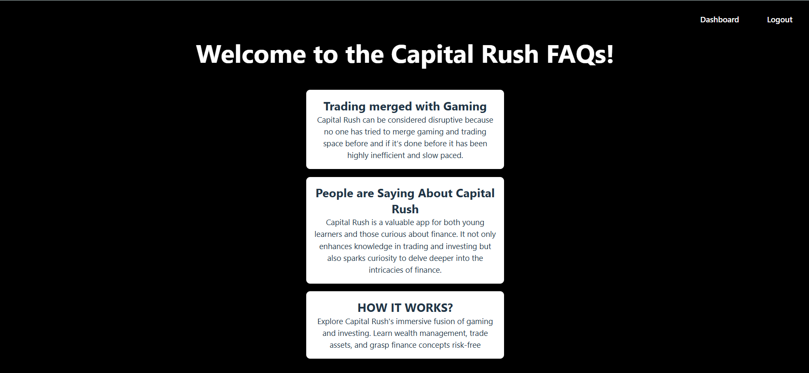

# Web Developer Technical Assignment - Capital Rush

## 🚀 Objective
Design and develop a full-stack web application using **React, Firebase, and Node.js** that allows users to sign up, log in, and create, edit, and delete posts. The application is **responsive, secure, and optimized for performance**.

## 📌 Features
### 🔐 User Authentication (Firebase Authentication)
- Sign-up and login functionality using **Firebase Authentication** (Email/Password authentication).
- Error handling for failed authentication attempts.
- Protected authenticated routes.

### 🎨 Frontend (React, Tailwind CSS)
- **Home Page**: Displays a list of posts created by users.
- **Sign-up/Login Page**: Allows user authentication.
- **Dashboard**: Enables logged-in users to create, edit, and delete their posts.
- Form validation and user-friendly error messages.
- Fully responsive UI with **Tailwind CSS**.

### 🖥 Backend (Node.js, Express, Firebase Firestore)
- **Express server** to handle API requests.
- **CRUD operations for posts**:
  - Create: Authenticated users can create posts (title, description, and timestamp stored in Firestore).
  - Read: Fetch and display posts on the Home page.
  - Update: Users can edit their own posts.
  - Delete: Users can delete their own posts.
- Authentication and authorization to ensure users modify only their own posts.

### 🔥 Firebase Firestore (Database)
- User data and posts stored securely in Firestore.
- Optimized queries for fetching only necessary data.

### 🌎 Deployment & Version Control
- **Frontend hosted on Vercel**.
- **Backend deployed on Vercel**.
- **GitHub repository for version control**.

## 📷 Screenshots



## 🔧 Installation & Setup
### 1️⃣ Clone the repository:
```sh
git clone https://github.com/Asmit-Rai/Capital-Rush.git
cd Capital-Rush
```

### 2️⃣ Install dependencies:
```sh
# For frontend
cd capital-rush
npm install

# For backend
cd capital-rush-backend
npm install
```

### 3️⃣ Setup environment variables:
Create a `.env` file in both frontend and backend folders with necessary credentials.

### 4️⃣ Run the application:
```sh
# Start frontend
npm run dev

# Start backend
cd backend
nodemon start
```

### 5️⃣ Deploy to production:
```sh
# Deploy frontend to Vercel
vercel

# Deploy backend to Vercel
vercel
```

## 🌐 Live Demo
[Live Project Link](capital-rush01.vercel.app)

## 📂 Folder Structure
```
Battle Rush/
│── capital-rush/        # React frontend
│── capital-rush-backend/         # Node.js backend
│── README.md        # Project documentation
│── .gitignore       # Git ignore file
```


## 📩 Contact
For any queries, reach out at **raiasmit99@gmail.com** or connect on [LinkedIn](https://www.linkedin.com/in/asmit-rai-b4a614224/).
